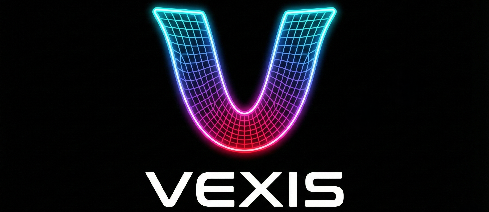

# VEXIS CAE

VEXIS CAE is an automated Finite Element Analysis (FEA) pipeline designed for large-deformation and buckling simulations of rubber dome, typically for membrane keyboard. It streamlines the workflow from raw CAD models(.step) to analyzed simulation results.

This software is licensed under the [GNU GPL v3](LICENSE).


*Example of Force-Stroke analysis result.*

## Key Features

- **Adaptive Mesh Generation**: Automatically creates high-quality hybrid meshes (Hex/Tet) from STEP files using a butterfly O-grid algorithm to ensure convergence during buckling.
- **FEBio Integration**: Seamlessly handles FEBio input file generation, mesh swapping, and solver execution.
- **Real-time Monitoring**: Features interactive progress bars for monitoring meshing and solver status.
- **Thread Control**: Configurable CPU thread allocation via `config.yaml` to balance performance and system load.
- **Result Extraction**: Automatically parses FEBio results to generate Force-Displacement curves (`.csv`) and visual plots (`.png`).

## Core Workflow

1.  **Input**: Place `.stp` or `.step` files in the `input/` directory.
2.  **Meshing**: The system converts CAD geometry into a `.vtk` mesh optimized for stability.
3.  **Preparation**: The new mesh is injected into a `template.feb` file, with automatic reconstruction of boundary conditions and contact surfaces.
4.  **Solver**: Executes the FEBio solver with real-time feedback.
5.  **Output**: Simulation results are saved in the `results/` directory.
Results are consisted Force-Stroke graph (.PNG), its data (.csv) and solver log (.log) for validation. 

## Getting Started

### Prerequisites

- Python 3.9+
- [FEBio Studio](https://febio.org/) (FEBio4 solver)
- Required Python packages: `felupe`, `gmsh`, `meshio`, `lxml`, `pyyaml`, `tqdm`

### Quick Start

1.  Place your CAD file in `input/`.
2.  Configure your analysis parameters in `config.yaml`.
3.  Run the main controller:
    ```bash
    python main.py
    ```

**Advanced Options:**
- `python main.py --mesh-only`: Performs only mesh generation (generation of `.vtk` in `temp/`).
- `python main.py --skip-mesh`: Skips meshing and runs the analysis using the existing mesh in the `temp/` folder (useful for resuming or re-running solver).

## Documentation

For more detailed information, please refer to the following documents:
- [User Guide](doc/user_guide.html): General usage and troubleshooting.
- [Development Guide](doc/Development_Guide_v04.md): Architecture and technical implementation details.

---
*Vexis is currently optimized for rubber keycap buckling analysis.*

Copyright (c) 2024-2025 PK