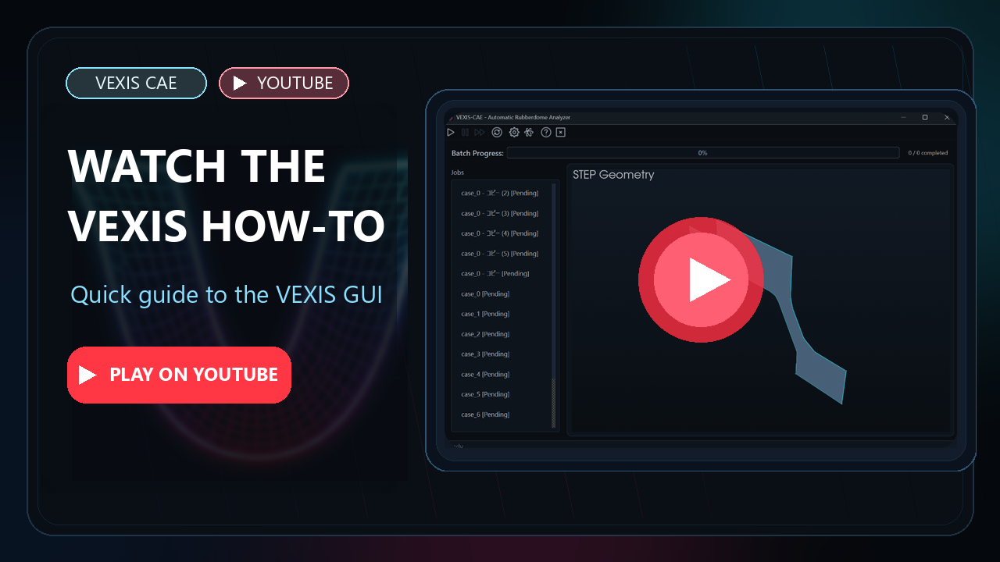

# VEXIS CAE


VEXIS CAE is an automated Finite Element Analysis (FEA) pipeline for large-deformation and buckling simulations of rubber domes, typically for membrane keyboards. It covers the workflow from `.stp` / `.step` input through meshing, FEBio execution, and post-processing into `.xplt`, CSV, graph, and interactive 3D review.

## Demo Video

GitHub README does not support inline YouTube playback. Click the play card below to open the VEXIS how-to video on YouTube.

<p align="center">
  <a href="https://www.youtube.com/watch?v=vNZM0MbpSeE">
    
  </a>
</p>

This software is licensed under the [GNU GPL v3](LICENSE).

## Key Features

- **Adaptive Mesh Generation**: Automatically creates high-quality hybrid meshes (Hex/Tet) from STEP files.
- **Windows GUI Workflow**: A PySide6 desktop UI with input-folder monitoring, batch progress, live logs, solver status, and mesh/result preview.
- **Interactive Results Review**: Loads `.xplt` results directly and provides force-displacement graphs plus 3D contour viewing with field switching for `displacement`, `Lagrange strain`, `stress`, and `velocity`.
- **Mesh-Only Mode**: Use **Gen Mesh** to generate and preview a mesh without starting the FEBio solve.
- **Keep Awake Toggle**: Prevent PC sleep during long-running analyses from the main toolbar.
- **Robustness**:
    - **Crash Handler**: Catches and logs unexpected errors safely.
    - **Logging**: Automatic file logging to `logs/` directory for troubleshooting.
- **FEBio Integration**: Works with the bundled `solver/febio4.exe` when present, or an external FEBio installation via configuration.
- **Packaged Windows Runtime**: The Windows distribution is built around `build_rust.py` and packaged as `VEXIS-CAE-Rust`.

## Core Workflow

1.  **Input**: Place `.stp` or `.step` files in the `input/` directory. The GUI watches this folder and registers jobs automatically.
2.  **Meshing**: The system converts CAD geometry into a `.vtk` mesh optimized for stability.
3.  **Preparation**: The new mesh is injected into `template2.feb` with automatic contact and control reconstruction.
4.  **Solver**: FEBio runs with real-time feedback in the GUI or CLI.
5.  **Review**: The application loads `.xplt` output for 3D review and writes extracted CSV / graph artifacts into `results/`.

## Getting Started

VEXIS can be run in two ways. Use the source route when developing or when you
clone this repository directly. Use the packaged route when you want to launch a
prebuilt Windows application.

### Option A: Run from Source

Use this route after cloning the repository. The Rust/Vulkan Python extension is
not committed as a binary artifact; each developer builds it locally.

#### Prerequisites

- Windows OS
- Python 3.11 or newer
- Rust toolchain from [rustup](https://rustup.rs/)
- Vulkan-capable GPU and current graphics driver
- [FEBio Studio](https://febio.org/) only if you want to use an external FEBio path; bundled `solver/febio4.exe` is used when available

#### Setup

```powershell
git clone https://github.com/A6721jpn/vexis.git
cd vexis

python -m venv .venv
.\.venv\Scripts\activate
pip install -r requirements.txt
pip install maturin

cd src\libs\vexis_vulkan_core
python -m maturin develop --release
cd ..\..\..
```

`src/libs/vexis_vulkan_core/target/` is intentionally not tracked in Git. It is
generated locally by Cargo during the Rust build.

#### Run the GUI

1.  Start the application:
    ```powershell
    python gui_main.py
    ```
2.  Place your CAD file in the `input/` folder. Use ASCII filenames such as `case_01.step` for reliable execution.
3.  Use **Gen Mesh** for mesh preview only, or **Start Batch** for the full analysis workflow.
4.  Once complete, select the job to inspect the force-displacement graph and 3D contour results.

#### Run the CLI

For headless automation:
```powershell
python main.py
python main.py --mesh-only
python main.py --skip-mesh
```

### Option B: Run a Packaged App

Use this route when you have a packaged VEXIS distribution such as
`VEXIS-CAE-Rust.exe`. The package includes Python runtime components and the
compiled Rust extension, so users do not need to install Python, Rust, or
`maturin` separately.

1.  Download or receive the packaged `VEXIS-CAE-Rust` distribution.
2.  Extract it to a writable folder.
3.  Launch `VEXIS-CAE-Rust.exe`.
4.  Place `.stp` or `.step` files in the packaged `input/` folder and run the workflow from the GUI.

To build the packaged app yourself from source, use the same Python environment
from Option A and run:

```powershell
pip install pyinstaller
python build_rust.py
```

## Documentation

For more detailed information, please refer to the following documents:

- [Workflow Guide (JA)](doc/workflow_guide_ja.md): Installation, data prep, and GUI reference.
- [Development Guide (JA)](doc/Development_Guide.md): Code structure, workflow internals, and developer notes.
- [Release Notes](doc/release_notes.md): Version history and changes.


---
*Vexis is currently optimized for rubber keycap buckling analysis.*

Copyright (c) 2024-2026 A.O.
