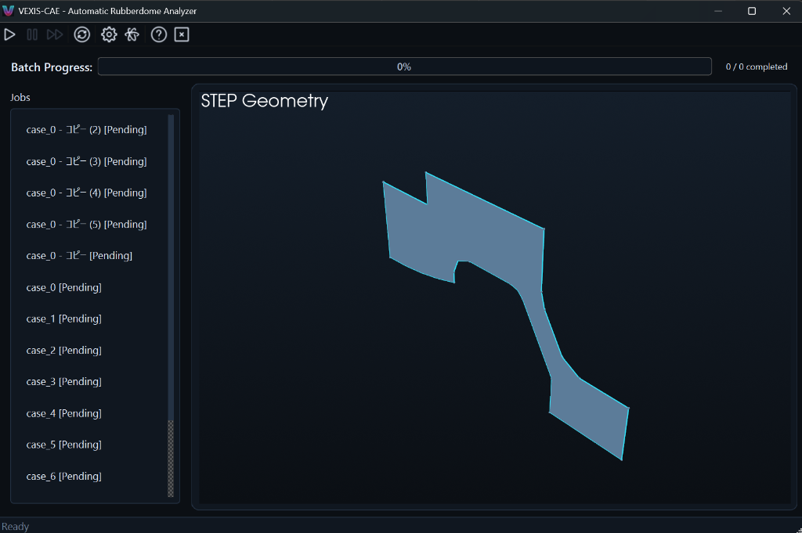

# VEXIS-CAE GUI リファレンスマニュアル

このマニュアルでは、VEXIS-CAE GUIの各要素と機能を解説します。

## 1. ツールバー (Toolbar)
上部のアイコン群から主要な操作を行います。

- **Start Batch (再生ボタン)**: リストにある全ての解析ジョブを順番に開始します。
- **Stop (一時停止ボタン)**: 実行中の解析を停止します。
- **Skip (スキップボタン)**: 現在のジョブをスキップし、次のジョブへ進みます。
- **Refresh (更新ボタン)**: `input` フォルダ内のファイルを再スキャンし、ジョブリストを更新します。
- **Config (歯車ボタン)**: `config.yaml` をテキストエディタで開き、解析やメッシュの設定を変更します。
- **Material (波線ボタン)**: `material.yaml` を開き、材料特性を編集します。
- **About (ハテナボタン)**: バージョン情報やライセンスを表示します。
- **Exit (バツボタン)**: アプリケーションを終了します。進行中の解析も停止されます。

## 2. バッチ進捗バー (Batch Progress)
- **ProgressBar**: 全ジョブのうち、完了したジョブの割合を視覚的に表示します。
- **Status Text**: 「完了数 / 全ジョブ数」を数値で表示します。

## 3. ジョブリスト (Jobs List)
左側のパネルには `input` フォルダ内のSTEPファイルが一覧表示されます。

- **Status表示**:
    - `[Pending]`: 解析待ち。
    - `[Running]`: 解析実行中。
    - `[Completed]`: 解析完了。
    - `[Error]`: 異常終了。

## 4. メインパネル (Main Panel)
ジョブのステータスに応じて表示内容が切り替わります。

- **STEP Geometry (表示中)**: 選択したジョブの3D形状（STEPファイル）をプレビューします。
- **Progress/Log**: 解析実行中に詳細な計算ログを表示します。
- **Result Viewer**: 解析完了後に、荷重-変位グラフなどの結果を表示します。

## 5. ステータスバー (Status Bar)
最下部にアプリケーションの現在の状況（Readyなど）を表示します。
